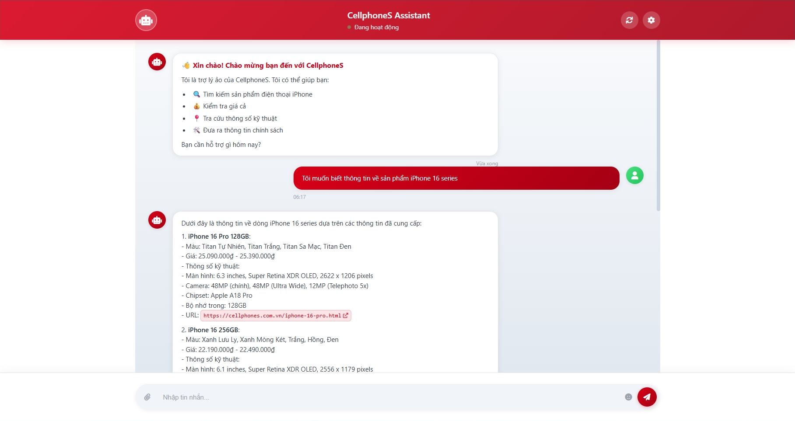

# CellphoneS Chatbot

<p align="center">
    
</p>

> Chatbot AI thông minh hỗ trợ khách hàng CellphoneS với công nghệ LLM và RAG

## Mục tiêu dự án

-   Xây dựng hệ thống chatbot AI hỗ trợ khách hàng CellphoneS tra cứu thông tin sản phẩm, chính sách, và giải đáp thắc mắc nhanh chóng, chính xác.
-   Ứng dụng công nghệ LLM kết hợp RAG để tăng độ tin cậy và tính thực tiễn của câu trả lời.
-   Tối ưu trải nghiệm người dùng với giao diện web hiện đại, dễ sử dụng trên mọi thiết bị.

## Cấu trúc thư mục dự án

```
CELLPHONEs_CHATBOT/
│
├── crawldata/                        # Script Selenium cào dữ liệu từ website CellphoneS
│   ├── crawl_description.py          # Cào mô tả sản phẩm
│   ├── crawl_faq.py                  # Cào câu hỏi thường gặp (FAQ)
│   ├── crawl_name_and_url.py         # Cào tên và đường dẫn sản phẩm
│   ├── crawl_policy.py               # Cào chính sách bán hàng, bảo hành,...
│   └── crawl_spec_and_variant.py     # Cào thông số kỹ thuật và các phiên bản sản phẩm
│
├── data/                             # Dữ liệu đã cào (JSON) dùng cho truy vấn
│   ├── faq.json                      # Dữ liệu câu hỏi thường gặp
│   ├── policy_dataset.json           # Dữ liệu chính sách
│   └── product_details.json          # Dữ liệu chi tiết sản phẩm
│
├── embeddings/                       # FAISS index và metadata cho truy vấn nhanh
│   ├── faiss_index.bin               # File FAISS index lưu embedding
│   └── metadata.pkl                  # Metadata cho các đoạn dữ liệu
│
├── frontend/                         # Giao diện web (HTML, CSS, JS)
│   ├── index.html                    # Trang giao diện chính
│   ├── script.js                     # Logic xử lý phía client
│   └── style.css                     # Giao diện, định dạng CSS
│
├── utils/                            # Các module xử lý dữ liệu, embedding
│   ├── chunking.py                   # Hàm chia nhỏ dữ liệu thành các đoạn
│   └── embedding.py                  # Hàm sinh embedding cho văn bản
│
├── .gitignore                        # Loại trừ file không cần thiết khi commit
├── .env                              # Lưu trữ API key Groq (bảo mật, không public)
├── app.py                            # Khởi tạo Flask server, endpoint API chính
├── CellphoneSChatbot.png             # Ảnh minh họa chatbot
├── rag_pipeline.py                   # Pipeline RAG: tìm kiếm, sinh câu trả lời, quản lý FAISS
├── README.md                         # Tài liệu hướng dẫn sử dụng, cài đặt, cấu hình
└── requirements.txt                  # Danh sách phụ thuộc Python
```

## Công nghệ sử dụng

-   **Python 3.10+**: Ngôn ngữ lập trình chính.
-   **Flask**: Xây dựng REST API backend.
-   **Sentence Transformers**: Sinh embedding cho dữ liệu đa ngôn ngữ.
-   **FAISS**: Lưu trữ và tìm kiếm embedding hiệu quả, tốc độ cao.
-   **Groq API (Meta Llama-4 Scout 17B)**: Large Language Model cho sinh câu trả lời tự động.
-   **Selenium**: Cào dữ liệu sản phẩm, chính sách, FAQ từ website CellphoneS.
-   **HTML/CSS/JS**: Xây dựng giao diện web responsive, hỗ trợ markdown, quick actions.
-   **scikit-learn**: Chuẩn hóa embedding.
-   **pickle**: Lưu trữ metadata và dữ liệu embedding.
-   **CORS**: Hỗ trợ frontend giao tiếp với backend.

## Kiến trúc hệ thống

```ascii
+------------------+      +-----------------+      +-------------------+
|  Frontend (Web)  | <--> |  Flask Backend  | <--> |  LLM + FAISS RAG  |
+------------------+      +-----------------+      +-------------------+
```

-   **Frontend**: Giao diện chat trực quan, hiển thị lịch sử hội thoại, quick actions, markdown formatting, trạng thái bot, và hỗ trợ đa nền tảng.
-   **Backend**: Nhận câu hỏi từ người dùng, truy vấn dữ liệu liên quan, sinh câu trả lời qua LLM, trả về kết quả cho frontend.
-   **RAG Pipeline**: Tìm kiếm thông tin liên quan từ dữ liệu cào, cung cấp cho LLM để sinh câu trả lời chính xác, có dẫn nguồn.

## Các module chính

-   [`app.py`](app.py): Khởi tạo Flask server, định nghĩa các endpoint API. **Đã được tối ưu** để tránh segmentation fault và threading conflicts.
-   [`rag_pipeline.py`](rag_pipeline.py): Pipeline RAG, gồm các bước tìm kiếm, sinh câu trả lời, và quản lý chỉ mục FAISS.
-   [`utils/chunking.py`](utils/chunking.py): Xử lý dữ liệu đầu vào, chia nhỏ thành các đoạn thông tin dễ truy vấn.
-   [`utils/embedding.py`](utils/embedding.py): Sinh embedding cho văn bản sử dụng Sentence Transformers.
-   [`crawldata/`](data/): Chứa các script Selenium để cào dữ liệu từ website CellphoneS.
-   [`embeddings/`](embeddings/): Lưu trữ FAISS index và metadata cho truy vấn nhanh.
-   [`frontend/`](frontend/): Giao diện web, gồm HTML, CSS, JS.

## Quy trình cào dữ liệu

-   Sử dụng **Selenium** để tự động thu thập dữ liệu sản phẩm, chính sách, FAQ từ website CellphoneS.
-   Dữ liệu được lưu dưới dạng JSON: [`product_details.json`](data/product_details.json), [`policy_dataset.json`](data/policy_dataset.json), [`faq.json`](data/faq.json).
-   Các module chunking xử lý dữ liệu thành các đoạn nhỏ, dễ truy vấn và sinh embedding.

## Pipeline RAG

1. **Tiền xử lý dữ liệu**: Cào và chuẩn hóa dữ liệu, chunk thành các đoạn ngắn.
2. **Embedding**: Sử dụng Sentence Transformers để chuyển đổi văn bản thành vector embedding.
3. **Lập chỉ mục FAISS**: Lưu trữ embedding, hỗ trợ tìm kiếm nhanh.
4. **Truy vấn**: Khi người dùng gửi câu hỏi, hệ thống tìm kiếm các đoạn thông tin liên quan nhất.
5. **Sinh câu trả lời**: LLM (Meta Llama-4 Scout 17B qua Groq API) nhận thông tin liên quan và sinh câu trả lời tiếng Việt, rõ ràng, có dẫn nguồn.

## Hướng dẫn cài đặt

### 1. Chuẩn bị môi trường

Khuyến nghị sử dụng môi trường ảo (conda):

```bash
conda create -n cps-chatbot python=3.10
conda activate cps-chatbot
```

### 2. Cài đặt phụ thuộc

```bash
pip install -r requirements.txt
```

Xem chi tiết các phụ thuộc trong file [`requirements.txt`](requirements.txt).

### 3. Cào dữ liệu (tuỳ chọn)

Chạy script Selenium để cào dữ liệu sản phẩm, chính sách, FAQ từ website CellphoneS. (Xem hướng dẫn trong thư mục [`crawldata/README.md`](crawldata/README.md))

### 4. Khởi tạo chỉ mục FAISS

Chạy server lần đầu sẽ tự động build FAISS index từ dữ liệu đã cào.

### 5. Chạy server

```bash
conda active cps-chatbot
python app.py
```

Server sẽ chạy tại `http://localhost:8000`.

### 6. Truy cập giao diện web

Mở file [`frontend/index.html`](frontend/index.html) bằng trình duyệt để sử dụng chatbot.

## Hướng dẫn sử dụng API

-   `POST /chat`
    -   **Body:** `{ "query": "Câu hỏi của bạn" }`
    -   **Trả về:** `{ "query": "...", "contexts": [...], "answer": "..." }`
    -   Xem chi tiết trong [`app.py`](app.py)
-   `GET /ping`
    -   Kiểm tra trạng thái server.
    -   Xem chi tiết trong [`app.py`](app.py)

## Bảo mật & lưu ý triển khai

-   **API Key Groq**: Đảm bảo bảo mật file `.env`, không public lên repository.
-   **CORS**: Đã cấu hình cho phép frontend truy cập backend.
-   **Dữ liệu cào**: Chỉ sử dụng cho mục đích demo/học tập, không dùng cho sản phẩm thương mại.
-   **Kiểm thử**: Đã kiểm thử với các trường hợp phổ biến, khuyến nghị kiểm thử thêm khi mở rộng dữ liệu.
-   **Ổn định hệ thống**: 
    - Ứng dụng đã được tối ưu để chạy ổn định với các thư viện ML/AI
    - Threading được cấu hình an toàn để tránh deadlock và memory leak
    - Production mode để đảm bảo hiệu suất tốt nhất

## Kiểm thử & gỡ lỗi

-   Kiểm tra log server khi gặp lỗi sinh câu trả lời hoặc truy vấn dữ liệu.
-   Đảm bảo các file dữ liệu JSON và embedding đã được tạo đúng định dạng.
-   Sử dụng endpoint `/ping` để xác nhận server hoạt động.

### Khắc phục lỗi thường gặp

**Lỗi Segmentation Fault:**
- Ứng dụng đã được cấu hình tự động để tránh lỗi này bằng cách:
  - Tắt debug mode trong production
  - Cấu hình `TOKENIZERS_PARALLELISM=false`
  - Giới hạn số threads: `OMP_NUM_THREADS=1`, `MKL_NUM_THREADS=1`

**Lỗi kết nối:**
- Đảm bảo môi trường ảo `cps-chatbot` đã được kích hoạt
- Kiểm tra server đang chạy: `curl http://127.0.0.1:8000/ping`
- Kiểm tra process: `ps aux | grep "python app.py"`

**Cách test API:**
```bash
curl -s http://127.0.0.1:8000/ping
```
```bash
curl -X POST http://127.0.0.1:8000/chat \
  -H "Content-Type: application/json" \
  -d '{"query":"hello"}'
```

## Tài liệu tham khảo

-   [Sentence Transformers](https://www.sbert.net/) - Thư viện tạo embedding đa ngôn ngữ
-   [FAISS](https://github.com/facebookresearch/faiss) - Thư viện tìm kiếm vector hiệu suất cao
-   [Groq API](https://groq.com/) - API cung cấp LLM hiệu năng cao
-   [Selenium](https://www.selenium.dev/) - Công cụ tự động hóa trình duyệt web
-   [CellphoneS](https://cellphones.com.vn/) - Website chính thức của CellphoneS

## Đóng góp & phát triển

-   Tuân thủ PEP 8, code rõ ràng, có docstring và comment đầy đủ.
-   Quản lý phụ thuộc qua `requirements.txt`.
-   Mọi đóng góp vui lòng tạo pull request hoặc liên hệ qua email.

## Liên hệ

-   **Trần Hữu Phúc**
-   Email: phuctranhuu37@gmail.com

---

> Dự án này chỉ phục vụ mục đích học tập, không dùng cho sản phẩm thương mại.
